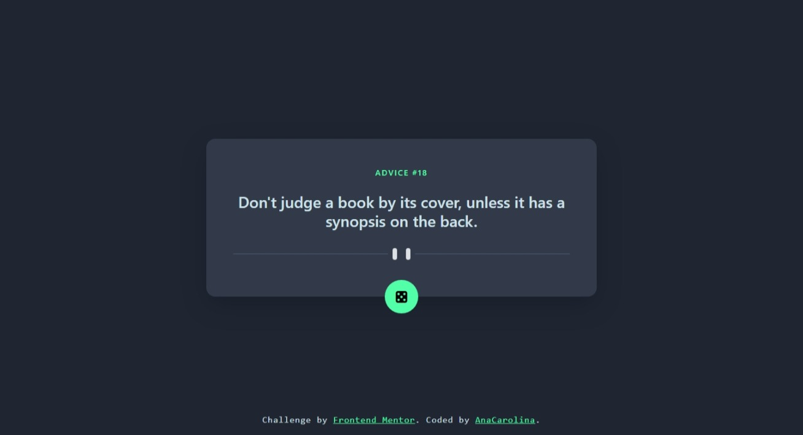

# Frontend Mentor - Advice generator app solution

[Pt-br Readme](./README_pt-br.md)

This is a solution to the [Advice generator app challenge on Frontend Mentor](https://www.frontendmentor.io/challenges/advice-generator-app-QdUG-13db). Frontend Mentor challenges help you improve your coding skills by building realistic projects.

## Table of contents

- [Overview](#overview)
  - [The challenge](#the-challenge)
  - [Screenshot](#screenshot)
  - [Links](#links)
- [My process](#my-process)
  - [Built with](#built-with)
  - [What I learned](#what-i-learned)
  - [Continued development](#continued-development)
  - [Useful resources](#useful-resources)
- [Author](#author)

## Overview

### The challenge

Users should be able to:

- View the optimal layout for the app depending on their device's screen size
- See hover states for all interactive elements on the page
- Generate a new piece of advice by clicking the dice icon

### Screenshot

<!--  -->

### Links

- Solution URL: [https://github.com/AnaCarol2001/AdviceGeneratorApp](https://github.com/AnaCarol2001/AdviceGeneratorApp)
- Live Site URL: [https://anacarol2001.github.io/AdviceGeneratorApp/](https://anacarol2001.github.io/AdviceGeneratorApp/)

## My process

### Built with

- Semantic HTML5 markup
- Bootstrap/CSS
- Flexbox
- Mobile-first workflow
- JavaScript
- Async/Await
- [Advice Slip JSON API](https://api.adviceslip.com/)

### What I learned

This project was an opportunity to try out the CSS framework Bootstrap. It was easier than expected after getting used to the classes names. Additionally, I learned about promises, then, and async/await functions, which allowed me to access data from an API successfully.

### Continued development

- Since Bootstrap makes it easy and faster to design web applications, I plan to use it in future projects. 

- I will also continue studying APIs and async/await functions to understand these essential concepts better. 

### Useful resources

- [Bootstrap 5 CheatSheet](https://bootstrap-cheatsheet.themeselection.com/) - Easer way to find the bootstrap classes. 
- [Async/await](https://www.alura.com.br/artigos/async-await-no-javascript-o-que-e-e-quando-usar) - This is an article which helped me undestand Async/Await.

## Author

- Frontend Mentor - [Ana Carolina](https://www.frontendmentor.io/profile/AnaCarol2001)

