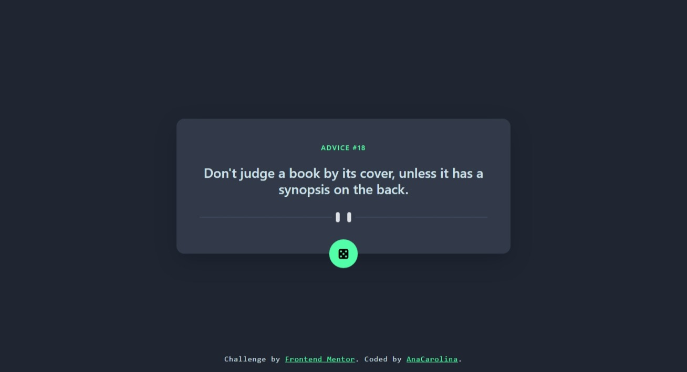

# Frontend Mentor - Solução do app de geração de conselhos

[English Readme](./README.md)

Esta é a solução para o [ Desafio de app de geração de conselhos no Frontend Mentor](https://www.frontendmentor.io/challenges/advice-generator-app-QdUG-13db). Os desafios do Frontend Mentor ajudam a melhorar as habilidades de codificação por meio do desenvolvimento de projetos realistas. 

## Tabela de conteúdos

- [Visão geral](#visão-geral)
  - [O Desafio](#o-desafio)
  - [Captura de tela](#captura-de-tela)
  - [Links](#links)
- [Meu processo](#meu-processo)
  - [Desenvolvido com:](#desenvolvido-com)
  - [O que aprendi](#o-que-aprendi)
  - [Desenvolvimento contínuo](#desenvolvimento-contínuo)
  - [Links úteis](#links-úteis)
- [Autora](#autora)

## Visão geral

### O Desafio

Usuários deveriam ser capazes de:
- Ver o layout ideal do app dependendo do tamanho da tela de seu dispositivo;
- Ver os estados de foco (hover states) de todos os elementos interativos da página;
- Gerar um novo conselho ao clicar no ícone de dado. 

### Captura de tela

<!--  -->

### Links

- URL da Solução: [URL]()
- URL do Site: [URL]()

## Meu processo

### Desenvolvido com:

- Marcação HTML5 semântica
- Bootstrap/CSS
- Flexbox
- Mobile-first workflow
- JavaScript
- Async/Await
- [Advice Slip JSON API](https://api.adviceslip.com/)

### O que aprendi

Este projeto foi uma oportunidade para usar o CSS framework Bootstrap. Foi mais fácil do que esperado depois que me acostumei com os nomes das classes. Além do mais, aprendi sobre promises, then e async/await, o que me permitiu acessar dados de uma API com sucesso. 

### Desenvolvimento contínuo

- Como o Bootstrap torna o processo de desenvolvimento do design da aplicação web mais fácil e rápido, planejo utilizar em projetos futuros. 

- Também continuarei estudando sobre APIs e async/await para melhor compreender esses conceitos fundamentais.

### Links úteis

- [Bootstrap 5 CheatSheet](https://bootstrap-cheatsheet.themeselection.com/) - Mais fácil para encontrar as classes do Bootstrap 
- [Async/await](https://www.alura.com.br/artigos/async-await-no-javascript-o-que-e-e-quando-usar) - Este artigo me ajudou a compreender Async/await. 

## Autora

- Frontend Mentor Profile - [Ana Carolina](https://www.frontendmentor.io/profile/AnaCarol2001)

